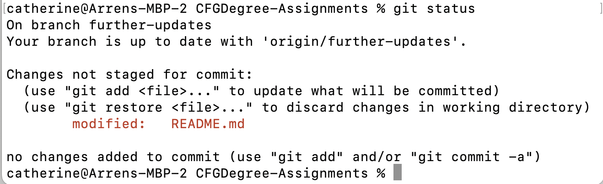
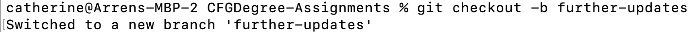
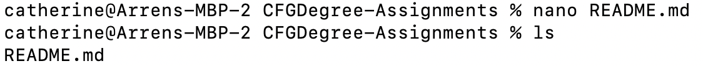
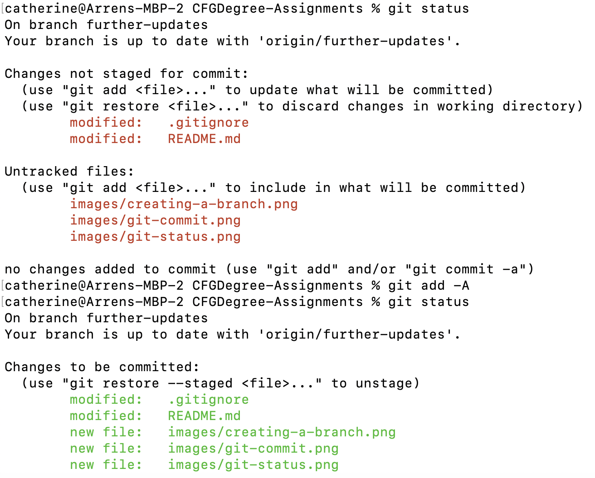
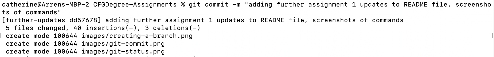
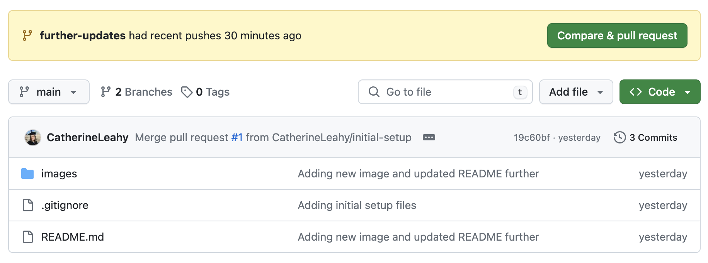
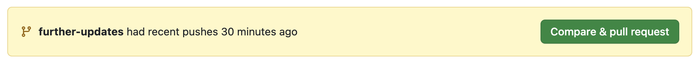
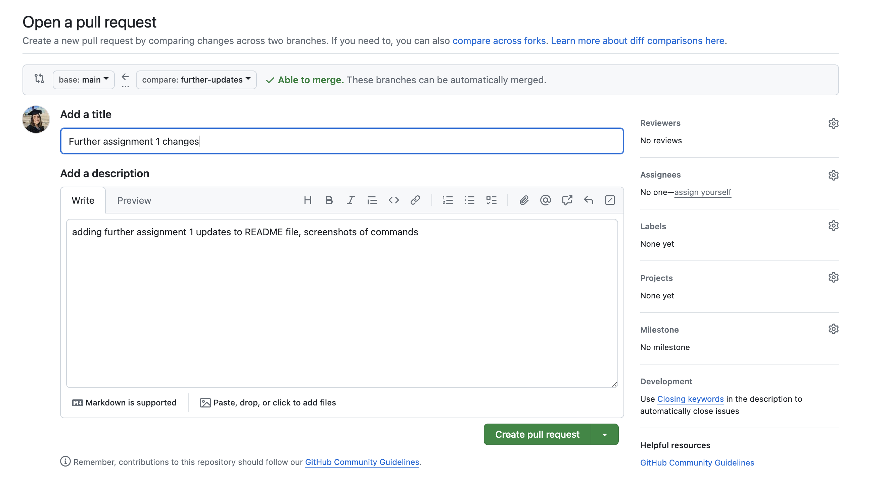
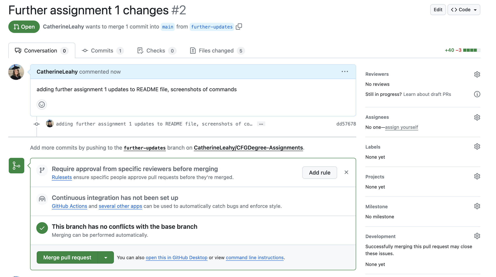
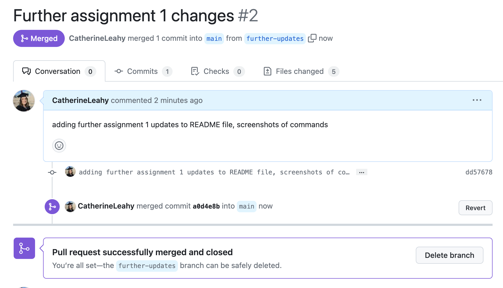

# Assignment 1 :rocket:
## Introduction
Assignment 1 of the CFGDegree is centered around Git and GitHub operation. Git was installed and a GitHub account created before demonstrating various operations such as: 
- Creating and using repositories
- Navigating directories
- Creating and adding files to branches
- Opening pull requests

## About Me :woman_scientist: :arrow_right: :woman_technologist:
I have been working in a Corrosion Laboratory in various roles for almost 7 years before joining the CFGDegree. My coding experience to date consists of some introductory matlab coding in my final year of university, and then a few MOOC Sprints through CFG. I'm super excited to be advancing my skills further on the CFGDegree.
### My Cats :cat2:

In my free time, I love spending time at home with my three cats. Above are my oldest two Sashimi and Maki.
## Useful Commands :writing_hand: 
Some commands I found useful during the assignment, particularly the directory navigation commands. 
- `git status` - shows status of current git branch
- `pwd` - shows current directory
- `cd` - change directory 
- `git add` - add new changes ready to be committed 
- `ls` - list files in current directory
## Question 1 - Using Git and GitHub :desktop_computer:
- ***Checking the status***
  - Command - `git status`
  - 
  - Git status is checked to get information such as: 
    - which branch you're currently on
    - if the branch is up to date
    - any changes yet to be committed
    

- ***Creating a branch*** 
  - Command - `git branch <branch name>` or `git checkout -b <branch-name>`
  -  
  - `git branch` is used to create a new branch, but does not automatically switch to the newly created branch
  - `git checkout -b` creates a new branch and then automatically switches to the newly created branch

- ***Adding files to a branch*** 
  - Creating files
    - Command - `nano <file-name>` 
    - 
    - A new file called README.md is created and opened in nano text editor
  - Staging file ready to be committed
    - Command - `git add <file-name>` or `git add -A`
    - 
    - Checking the git status tells me that there are two files with changes yet to commit, and three png files added to the images folder of my repository. The command `git add -A` is used to stage all files ready to be committed rather than naming an individual file.

- ***Adding commits with meaningful messages*** 
  - Commands -`git commit -m <message>`
  - 
   - 
   - Commits added to local repository with a message explaining the commit. The message is then displayed in the repository on the GitHub website.

- ***Opening a pull request***
  - Done on GitHub website
  - 
  - 
  - 
  - A pull request is opened on the github website as shown in the screenshots. 

- ***Merging and deploying to main branch*** 
  - Done on GitHub wesbite
  - 
  - Commits from the further-updates branch are merged into the main branch of the repo.

- ***Create .gitignore***
  - A hidden file was created on PyCharm called .gitignore, containing a list of files that should be ignored when choosing what to commit. I added:
    - .idea folder - this contains PyCharm configuration files that I didn't need to commit
    - .DS_Store files - these are MacOS metadata files that I didn't need to commit

- ***Create requirements.txt***
  - Command - `touch <file-name>`
  - The `touch` command creates a generic file without opening in any text editor like the `nano` command. My requirements.txt file is empty, however these files are normally used to store packages and/or libraries required for the project.

